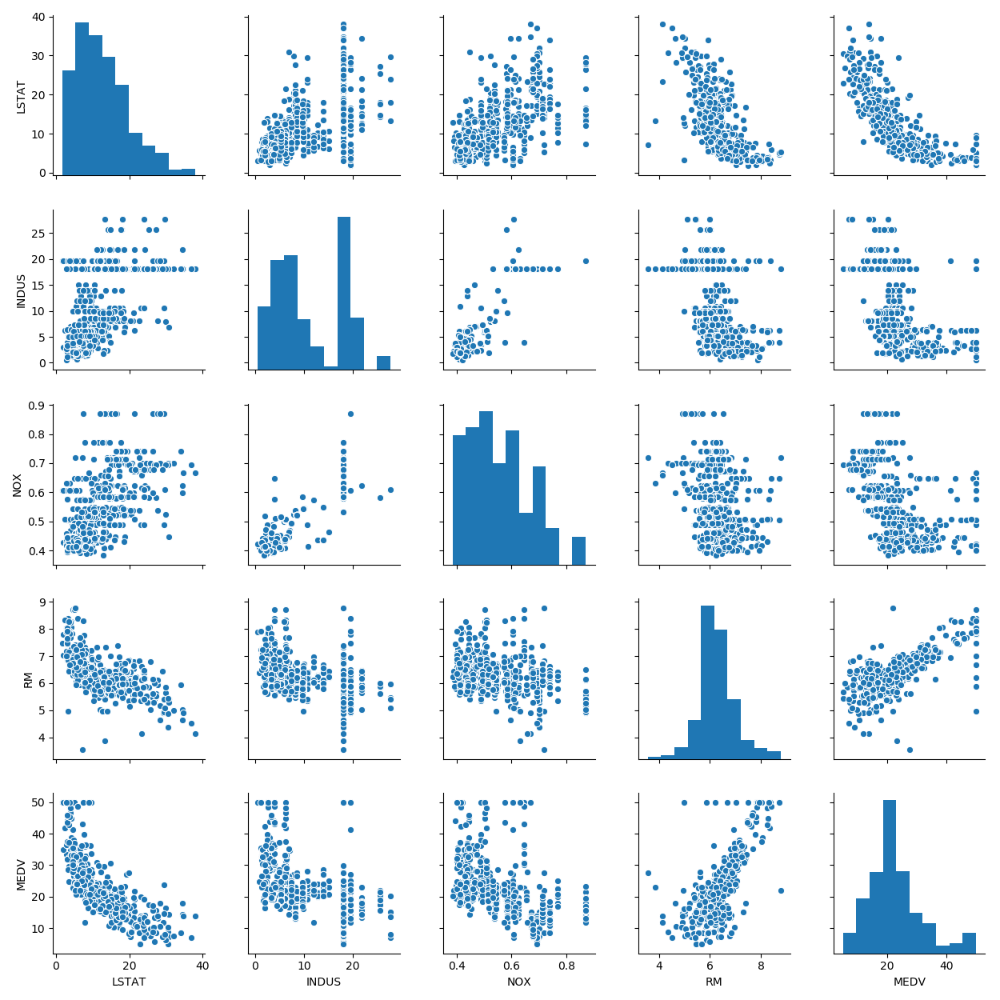
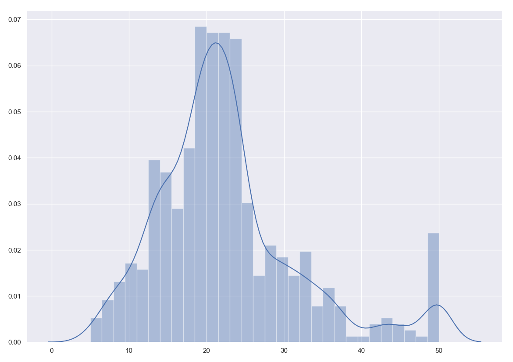
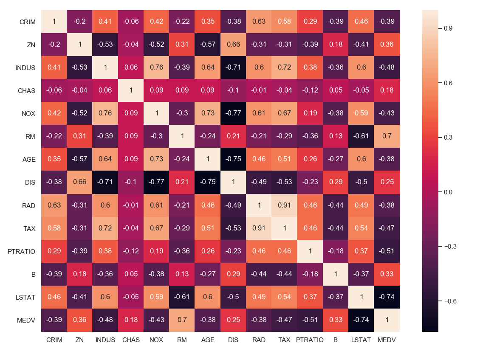

# Block 3 Artificial Intelligence:
# Week 3 Day 3 Homework Assignment:  Linear Regression, Non-Linear Regression, CART
1. Your task on the daily assignment is to get the ***best possible prediction on a test set*** (30% of corpus) using feature selection and feature transformation. 

2. Describe the analysis used to make your final data set and the regression machine(s) used for your predictions.

---
# Description of my process
1. Feature Selection:
    
    > After loading in the Boston Housing Data and importing the necessary libraries for the duration
    of the project. I began by separating the data into different portions (Rest of the Data(13/14 columns), Label / Target Data (14th column)).
    I immmediately tested to see if any of the data was empty or NAN. After seeing that all the data was 
    filled out, I printed the distribution/histogram plot of the MEDV (target)  and found it to be 
    pretty normally distributed with little outliers in the  data. 
2. Feature Transformation:
    
    > after realizing the data was fine, I plotted
    the correlation matrix in the form of a heatmap and selected the features that were highly correlated with the
    target value MEDV. I created X which is a dataframe that contains the most highly correlated values(w.r.t Target).
    I began to train_test_split the dataset into thee required 70 / 30 split. This is where I began to fit and train the data in
    various models

# Day 1 Results 
## Time Invested: (11/7/2018 7pm - 11/8/2018 2:15am)
1. Analysis used to make the final data set:
        I determined the final data set should be the kth most highly correlated features.
        I then made a dataframe containing the kth best features. I did not use any Standard Scaler
        on the new DataFrame.
        
2. Regression Model(s) used for prediction:
    1. Linear Regression
    2. Lasso Regression
    3. Quadratic Fit 
    4. Attempted Ridge Regression (?)
    
    My Best Results came from the Quadratic Fitted Linear Regression:
    1. Training MSE quadratic: 14.284 equal to RMSE of 3.779
    2. Training R^2 quadratic: 0.837
    3. Testing MSE quadratic: 13.379
    4. Testing R^2 quadratic: 0.820

## Next Potential Steps:
1. After discussing this with Dr. Richard, I will be testing SVM on the dataset today
2. Transform Feature on one of the two dimensions apply log 
3. Use Principal Component Analysis

# Day 2 Results
## Time Invested: (11/8/2018 1:20pm - 2:02pm, 9pm - 11:52pm )
1. Started the second day taking Richard's last recommendation to Scale the Values
2.  Record the results across the various Machines
3. Then discuss with Richard the potential of dimensionality reduction and it's immplications on the data
    
            
Linear Regression results for StandardScaled Data:
        RMSE is 0.5668831576470151 this is much better than the Quadratic Curve in Day 1
        R2 score is 0.6786434855761492
        
Quadratic Regression results for StandardScaled Data:
        RMSE quadratic: 0.416
        R^2 quadratic: 0.827
    
quadratic is still outperforming the linear regression with it's RMSE score
    being the best among all runs and having a high correlation amongst the chosen features
    it is doing well.
    
## --UPDATE @ 11:18pm--
By using PCA and reducing the dimensions of the second dataframe made of value that had the best correlation with the target, I was able to fix the problem with the training set having a better score than the test set

    >The model performance for training set
    --------------------------------------
     RMSE is 0.6047551265167522
     R2 score is 0.6487385786896802

    >The model performance for testing set
    --------------------------------------
    RMSE is 0.5927358668036734
    R2 score is 0.6019543580919947
    
## --UPDATE @ 11:48pm--
I was able to get the Linear Model and Quadratic Models to reduce their RMSE measure with the train set error being slightly worse than the test set RMSE measure.
    
<b>NOTE: This does not apply to the Cubic Model for some reason</b>

## Short Comings:
Because I got back to working on this after my adjunct and sending a good portion of my day looking for Higher Order Neural Network Results and in the worse case an alternative project that will fit within the time constraint, I was unable to add the remaining features that I 
 discussed with the Professor
1.   The Regularization Terms
2.  The SVM, due to fixing the training vs test error problem
3. Potential using dimensionally reduction or apply math functions on certain features to reduce their complexity
    

<b>It was still really cool to try to apply what I learned in Class freely on this Dataset. I would highly recommend anyone interested in Data Science try it</b>
